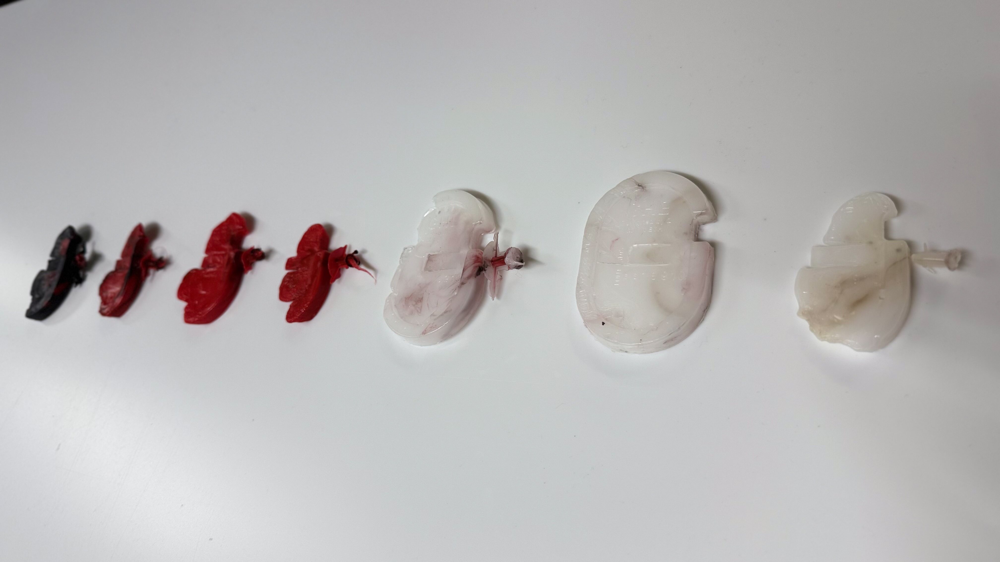
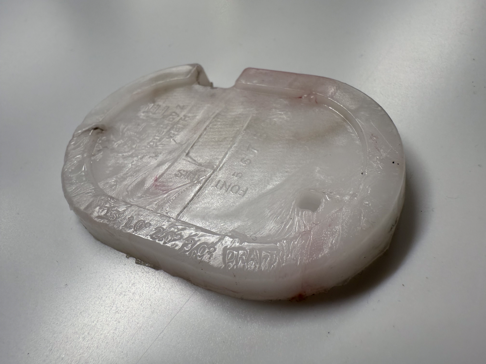
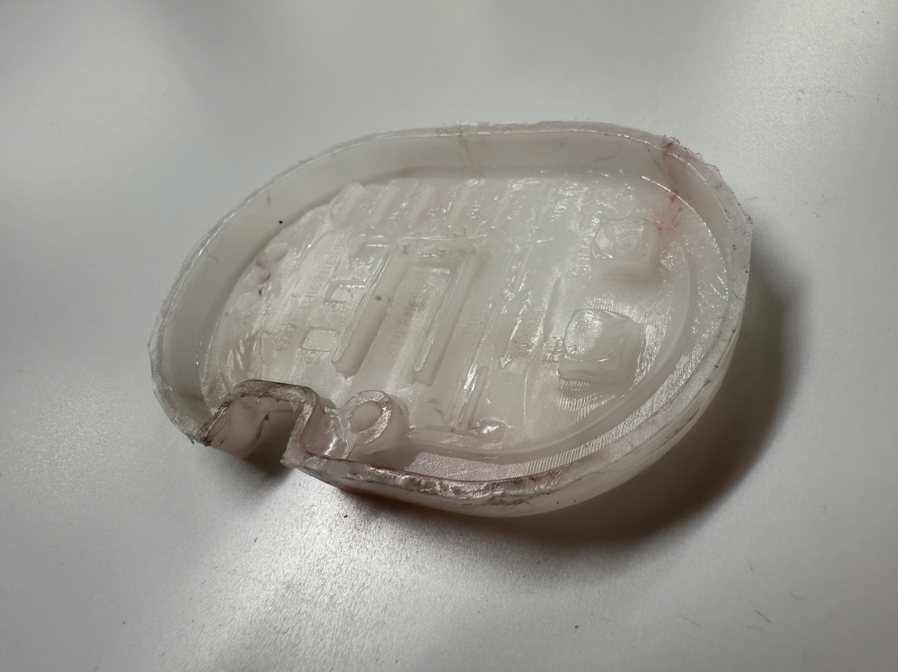

# Resin Molds for Recycled Plastic Injection Molding Research at Global Health Engineering ETH Zürich

Gaugey is design rule test piece inspired by Benchy (3D printing) but for injection molding using resin molds.

## Introduction
**Injection molding typically serves mass production—millions of parts from costly metal molds—but what if you need just 100 precision, mechanically robust components in resource-constrained settings?** To what extent can self-made resin molds bridge this gap, enabling DIY production of high-fidelity plastic parts without industrial infrastructure?

This research project explores the use of resin molds for recycled plastic injection molding, building on the work of Precious Plastics and previous ETH Zürich projects. The goal was to develop practical guidelines for designing and manufacturing resin molds that can be used with recycled plastics like PP (polypropylene) and HDPE (high-density polyethylene) in small-scale recycling operations using the Holimaker Holipress Desktop Injection Moulding Machine.

## Motorized Shredder Linkage System
**From Manual Labor to Automated Recycling**  
The research begins with a practical challenge: the lab’s Holimaker Holishred manual shredder requires intensive effort to process just 1 bottle cap per minute. To enable scalable recycling of HDPE caps—that can be used for molding instead of buying PP pellets online—I engineered a motorized linkage system that transforms this slow, labor-intensive process into an automated workflow.

**Key Achievement:** Designed and implemented a motor linkage system that increased shredding capacity from 1 to 20 bottle caps per minute, eliminating manual labor.

### Shredder Linkage Development
1. **Challenge**: 
   - Original manual shredder could only process 1 bottle cap per minute
   - Needed reliable connection between motor shaft and shredder mechanism

2. **Design Process**:
   - Initial attempts with slotted spring pins proved problematic (3/11)
   - Finalized C-shape extrusion design with disk clamp (4/10)
   - Optimized for manufacturability and strength

3. **Implementation**:
   - Successfully machined and installed (5/8)
   - Wooden stand laser cut to hold the motor

4. **Results**:
   - 20x capacity improvement
   - Cost-effective solution via JLC PCB ($91.09)
   - Perfect fit and reliable operation confirmed (5/15)

### Shredder Linkage Development Photos

  
  
  

  From left: components, assembly, linkage attached to shredder

## Small-Scale Injection Molding Background Research
Key resources informed the work:
- Precious Plastics community guidelines on injection molding and mold design
- Industrial design standards from RapidDirect and Fictiv injection molding guides
- Previous ETH work by Lorenzo on HDPE molding challenges

Critical design considerations are identified in the Pictorial on top of the page.

## Progress and Methodology

*black and red: HDPE | white: PP*

### Phase 1: Gaugey: Design Rule Test Piece
Developed Gaugey, comprehensive test piece aiming to push the limits of the Holipress machine and resin molds incorporating:
- **Boss** for threaded insert
- **Coring** to control wall thickness and reduce material waste
- **Draft angles** to show how easy part can be removed
- **Font size** to see what is legible
- **Gate** as the entry point for plastic
- **Parting line** where the two halves meet
- **Radius** calculation for round corners that improve moldability and reduce stress
- **Ribs and sink** that distribute stress and support structure
- **Undercut** can be avoided by orienting features parallel to draw line and cutting a hole following the projection of the undercut
- **Shrinkage** to compare intended dimensions to actual
- **Stiftness** to gauge material
- **Wall thickness** that depends on material
- **Venting configurations** to relieve pressure

### Phase 2: Mold Development
Experimentation with:

1. **Resin Molds**:
   - First tested with grey resin (did not mold well) and then rigid 10k (all printed on FormLabs Form 3+)
   - Learned resin expansion characteristics (60mm → 60.5mm after warming → 60.3mm after cooling )
   - Reduced dimensions by 0.4mm to compensate and sand off support touchpoints
   - Strengthened undercut walls
   - Optimized venting (increased from 0.05mm to 0.1mm depth)

2. **Injection Parameters**:
   - Temperature optimization
	   -  PP worked best at 230°C
	   -  HDPE worked best at 270°C
   - Cooling time ≈ 1 minute
   - Heating the resin with a heat gun improved plastic flow

### Phase 3: Material Testing
- PP: Successful molding after vent adjustments
- HDPE: Challenging - the plastic flowed harder through 
- Learned heat management is crucial for different materials

## Results and Key Learnings

### Successful Outcomes
1. Functional PP molding achieved (5/15)
   - Proper venting and temperature control were critical
   - Final shrinkage adjustment: 1.6% shrinkage in length and width 
   - Height showed greater variance: +12.4% probably because the mold could have been clamped tighter
2. Developed design guidelines (see Pictorial)
3. Motor installation for shredder successfully completed via JLC PCB order

  
  

### Key Findings

1. **Design Rules**:
   - Venting is paramount: 4 primary vents along 100mm parting line + 2 secondary vents + 1 bigger drain hole at the opposite side of the gate (same dimension) if vent is not enough
   - Undercut flanges in resin molds are fragile:
     - With two cantilevers in the design, strengthening one weakens the other. In resin or plastic, both will likely break off because neither can handle the stress, so undercuts work best with metal molds
   - White PP shows poor detail visibility vs red HDPE
   - R2 = R1 + t for proper corner radii

2. **Process Parameters**:
   - PP ideal at 230°C
   - Cooling time ≈ 1 minute
   - Mold pre-heating can help with plastic flow (400°C heat gun for 1 minute)
   - Mold release essential for demolding

3. **Material Behavior**:
   - PP more forgiving than HDPE
   - HDPE requires different temperature profile and gate/vent adjustment for better flow (in the future).

4. **Manufacturing Insights**:
   - 3D printed resin molds can withstand limited injection cycles and optimized paramters but detailed features will chip off with increased cycles
   - Automatic desktop recycling of HDPE is a viable process for supplying pellets for injection molding
   - China manufacturing (JLC PCB) offered cost-effective solutions for metal parts

### Challenges and Solutions

1. **Initial Failures**:
   - First injection attempt failed (4/16)
   - Solution: Added vents, adjusted dimensions, changed to Rigid 10K resin

2. **Material Issues**:
   - HDPE didn't flow well
   - Solution: Increased temperature, added vents, tried with another material PP

3. **Dimensional Accuracy**:
   - Shrinkage variability
   - Solution: Systematic measurement and compensation (-0.4mm)

## Conclusion
Overall, desktop injection molding with resin molds is difficult, especially when using manual machines that lack adjustable parameters like speed and pressure. However, Gaugey exhibits many of the key features required for injection molded parts, offering valuable insights into designing for resin-based injection molding.

While the process is challenging, resin molds can be effective for small-scale injection molding using recycled plastic, provided design principles are adhered to. The guidelines developed offer practical recommendations for wall thickness, rib design, venting, and processing temperatures, enabling successful molding with recycled PP. Although working with materials like HDPE remains problematic, this project has laid the groundwork for further advancements in sustainable plastic recycling through accessible mold-making techniques.

Future work should focus on:

1.  Gaining a deeper understanding of the molding process to improve success rates.
2.  Expanding material compatibility, particularly with HDPE.
3.  Enhancing mold durability to support longer production runs.