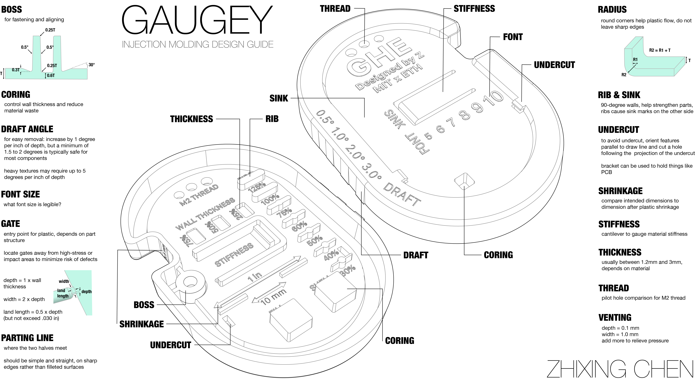

# Resin Molds for Recycled Plastic Injection Molding Research at ETH Zürich

# Resin Molds and Plastic Shredder System Research at ETH Zürich

## Introduction
This research project explores the use of resin molds for recycled plastic injection molding, building on the work of Precious Plastics and previous ETH Zürich projects. The goal was to develop practical guidelines for designing and manufacturing resin molds that can be used with recycled plastics like PP (polypropylene) and HDPE (high-density polyethylene) in small-scale recycling operations using the Holimaker Holipress Desktop Injection Moulding Machine.

## Motorized Shredder Linkage System
**Key Achievement:** Designed and implemented a motor linkage system that increased shredding capacity from 1 to 20 bottle caps per minute, eliminating manual labor.

### Shredder Linkage Development
1. **Challenge**: 
   - Original manual shredder could only process 1 bottle cap per minute
   - Needed reliable connection between motor shaft and shredder mechanism

2. **Design Process**:
   - Initial attempts with slotted spring pins proved problematic (3/11)
   - Finalized C-shape extrusion design with disk clamp (4/10)
   - Optimized for manufacturability and strength

3. **Implementation**:
   - Successfully machined and installed (5/8)
   - Wooden stand built to specifications (89.33mm diameter, 13.3cm height)
   - Optimal operation at 100 power, 0.5 speed settings

4. **Results**:
   - 20x capacity improvement
   - Cost-effective solution via JLC PCB ($91.09)
   - Perfect fit and reliable operation confirmed (5/15)

### Shredder Linkage Development Photos

  
  
  

  From left: CAD design, prototype testing phase, final installed motor linkage system

## Small-Scale Injection Molding Background Research
Key resources informed our work:
- Precious Plastics community guidelines on injection molding and mold design
- Industrial design standards from RapidDirect and Fictiv injection molding guides
- Previous ETH work by Lorenzo on HDPE molding challenges

Critical design considerations identified:

1. **Material Properties**: PP (230-270°C ideal) vs HDPE (higher temps, harder to glue)
2. **Wall Thickness**: Generally 1.2-3mm (PP: 1.02-3.81mm)
3. **Draft Angles**: Minimum 1.5-2° (up to 5° for textured surfaces)
4. **Ribs & Bosses**: Base thickness ≤2/3 adjoining wall, height ≤2.5x wall thickness
5. **Venting**: Critical for successful molding (0.05mm depth, 0.5-1.0mm width)

## Progress and Methodology

### Phase 1: Design Rule Test Piece
Developed a comprehensive test piece incorporating:
- Various wall thicknesses
- Ribs and bosses
- Undercuts
- Different draft angles
- Text features of varying sizes
- Venting configurations

Key iterations:
- Initial design proved difficult to manufacture due to slot complexity (3/11)
- Simplified to C-shape extrusion with disk clamp (4/10)
- Added more ribs and uniform wall thickness (3/31)

### Phase 2: Mold Development
Experimentation with:

1. **Resin Molds**:
   - Learned shrinkage characteristics (60mm → 60.5mm → 60.3mm)
   - Adjusted dimensions by 0.4mm to compensate
   - Strengthened undercut walls
   - Optimized venting (increased from 0.05mm to 0.1mm depth)

2. **Injection Parameters**:
   - Temperature optimization (PP worked best at 240°C vs 230°C)
   - Cooling time ≈20 seconds
   - Pressure requirements

### Phase 3: Material Testing
- PP: Successful molding after vent adjustments
- HDPE: Challenging - required new mold design due to snapping thin walls
- Learned heat management is crucial for different materials

## Results and Key Learnings

### Successful Outcomes
1. Functional PP molding achieved (5/15)
   - Proper venting and temperature control were critical
   - Final shrinkage adjustment: -0.4mm on all dimensions
2. Developed design guidelines (Appendix)
3. Motor installation for shredder successfully completed via JLC PCB order

### Key Findings

1. **Design Rules**:
   - Venting is paramount: 4 primary vents along 100mm parting line + 2 secondary vents
   - Gate design: Depth = 50% wall thickness for PP, width = 2x depth
   - Wall thickness consistency prevents warping and sink marks
   - R2 = R1 + t for proper corner radii

2. **Process Parameters**:
   - PP ideal at 240°C
   - Cooling time ≈20 seconds
   - Mold release essential for demolding

3. **Material Differences**:
   - PP more forgiving than HDPE
   - HDPE requires stronger mold walls and different temperature profile

4. **Manufacturing Insights**:
   - 3D printed resin molds can withstand limited injection cycles
   - China manufacturing (JLC PCB) offered cost-effective solutions for metal parts

### Challenges and Solutions

1. **Initial Failures**:
   - First injection attempt failed (4/16)
   - Solution: Added vents, adjusted dimensions, changed to Rigid 10K resin

2. **Material Issues**:
   - HDPE didn't flow well
   - Solution: Create dedicated HDPE mold with thicker walls

3. **Dimensional Accuracy**:
   - Shrinkage variability
   - Solution: Systematic measurement and compensation (-0.4mm)

## Conclusion
This research demonstrated that resin molds can be effective for small-scale recycled plastic injection molding when proper design rules are followed. The developed guidelines provide practical parameters for wall thickness, rib design, venting, and processing temperatures that enable successful molding with recycled PP. While challenges remain with materials like HDPE, the project established a foundation for further development of sustainable plastic recycling systems using accessible mold-making techniques.

Future work should focus on:
1. Expanding material compatibility (especially HDPE)
2. Improving mold durability for longer production runs
3. Developing standardized test pieces for community use
4. Optimizing the shredder system integration

## Appendix: Design Guidelines Summary

| Feature            | Parameter               | Notes                          |
|--------------------|-------------------------|--------------------------------|
| Wall Thickness     | 1.2-3mm                | PP: 1.02-3.81mm               |
| Draft Angles       | 1.5-2° minimum         | Up to 5° for textured surfaces |
| Rib Design         | Height ≤2.5T, Base ≤0.66T | Prevent sink marks           |
| Boss Design        | ≤60% wall thickness    | Proper radii at base          |
| Corner Radii       | R2 = R1 + t            | Internal ≥50% wall thickness  |
| Venting            | 0.05-0.1mm depth       | 4 primary + 2 secondary vents |
| Gate Design        | Depth=50% wall thickness | Width=2x depth              |
| Shrinkage          | Compensate -0.4mm      | Material dependent            |
| Temperature        | PP: 240°C              | HDPE requires higher          |